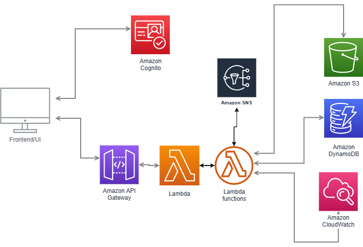

# **Home Energy Monitoring App**

## **Overview**
This is a cloud-based Home Energy Monitoring application that allows users to:
1. **Manually input energy usage data.**
2. **Upload energy consumption files (CSV).**
3. **View historical energy consumption trends.**
4. **Receive alerts when usage exceeds predefined thresholds.**
5. **Authenticate users via AWS Cognito.**

This project demonstrates AWS-based cloud architecture, including **serverless computing, storage, authentication, and monitoring.**

---

## **Architecture**
The system is **fully serverless** and built on AWS using:
- **Amazon API Gateway** → REST API exposure.
- **AWS Lambda** → Serverless compute for backend logic.
- **Amazon DynamoDB** → NoSQL database for energy data.
- **Amazon S3** → Storage for CSV file uploads.
- **Amazon Cognito** → User authentication.
- **Amazon SNS** → Alert notifications.
- **Amazon CloudWatch** → Logging and monitoring.

<p align="center">
  
</p>

---

## **API Endpoints**
### **User Authentication**
| Method | Endpoint | Description |
|--------|---------|-------------|
| `POST` | `/auth/signup` | Register a new user |
| `POST` | `/auth/login` | Log in an existing user |

### **Energy Data Management**
| Method | Endpoint | Description |
|--------|---------|-------------|
| `POST` | `/energy/input` | Manually input daily energy usage |
| `POST` | `/energy/upload` | Upload energy data via CSV |
| `GET`  | `/energy/history?startDate=YYYY-MM-DD&endDate=YYYY-MM-DD` | Retrieve historical energy usage |

### **Alerts and Notifications**
| Method | Endpoint | Description |
|--------|---------|-------------|
| `POST` | `/alerts` | Set up an energy usage threshold and trigger alerts |

---

## **How to Run the Project Locally**
Although the backend is **already deployed in AWS**, you can **test API requests** using Postman.

### **Prerequisites**
- **AWS CLI** installed and configured.
- **Postman** for API testing.
- **Python 3.12+** if running the Lambda functions locally.

### **1. Clone the Repository**
```sh
git clone https://github.com/bijanazodi/home-energy-monitoring.git
cd home-energy-monitoring
```

### **2. Set Up Environment Variables**
Create a `.env` file and add:
```
AWS_REGION=us-west-2
USER_POOL_ID=us-west-2_RzWzglt2w
APP_CLIENT_ID=1fu9qsuns3uuvkl13eapbn14ug
COGNITO_CLIENT_SECRET=1lnouq2b4nr3og89ifv24idhrjkqc7h1p3rl98f92356ovdmubto
DYNAMODB_TABLE=EnergyUsage
S3_BUCKET=home-energy-csv
SNS_TOPIC_ARN=arn:aws:sns:us-west-2:314146318953:EnergyAlerts
```

### **3. Test API Endpoints in Postman**
- **Sign up a new user**
  - `POST /auth/signup`
  - Body:
    ```json
    {
      "email": "test@example.com",
      "password": "SecurePass123!"
    }
    ```
- **Log in to receive authentication tokens**
  - `POST /auth/login`
  - Response contains `id_token`, `access_token`, and `refresh_token`.
- **Manually input energy usage**
  - `POST /energy/input`
  - Body:
    ```json
    {
      "userId": "test123",
      "date": "2024-06-10",
      "usage": 42.5
    }
    ```

---

## **Deployment (Optional)**
The AWS infrastructure is **already deployed**, but you can redeploy using **AWS SAM or Terraform**.

### **Deploy Using AWS SAM**
1. **Install AWS SAM CLI**
   ```sh
   brew install aws-sam-cli  # macOS
   choco install aws-sam-cli # Windows
   ```
2. **Build and Deploy**
   ```sh
   sam build
   sam deploy --guided
   ```

### **Deploy Using Terraform**
1. **Initialize Terraform**
   ```sh
   terraform init
   ```
2. **Apply the Configuration**
   ```sh
   terraform apply -auto-approve
   ```


